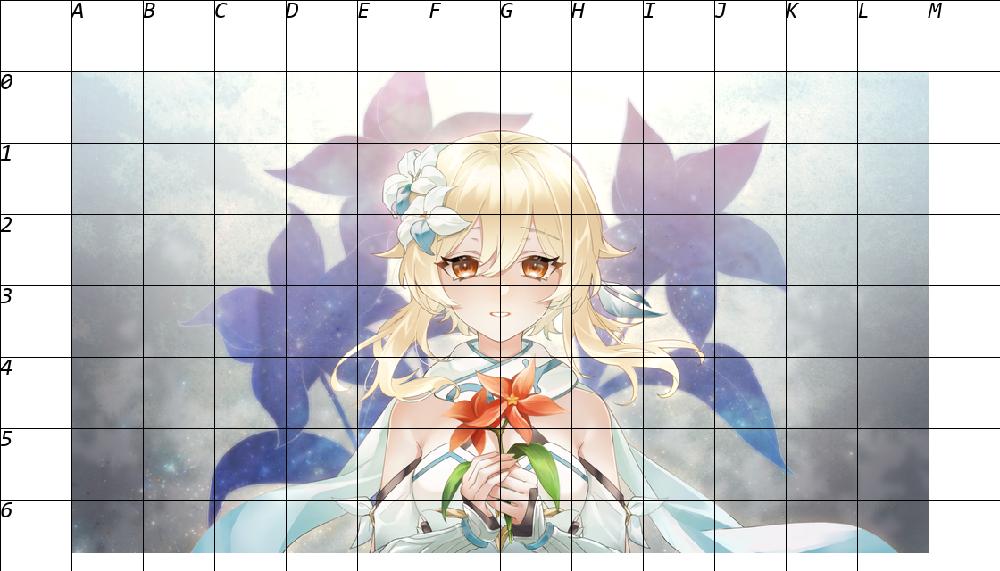

# GridEye 参考线绘制工具

原理很简单，就是将图片缩放后加上边框，按照指定的步长绘制一个坐标系。

住的地方找不到打印店，于是做了这样一个工具。

没有素描之类的基础，起形难度太高，又不想用复写纸。

据说欧洲中世纪的大型宗教壁画用的就是这个套路。

```
# 代码很简单，使用方法也很简单
# 第一个参数图片
# 第二个参数缩放比例
# 第三个参数步长
# 第四个参数输出文件

python grideye.py test.jpg 2 80 test-grid.png
```

